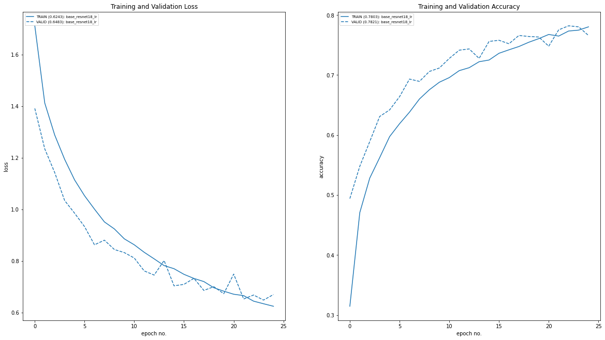
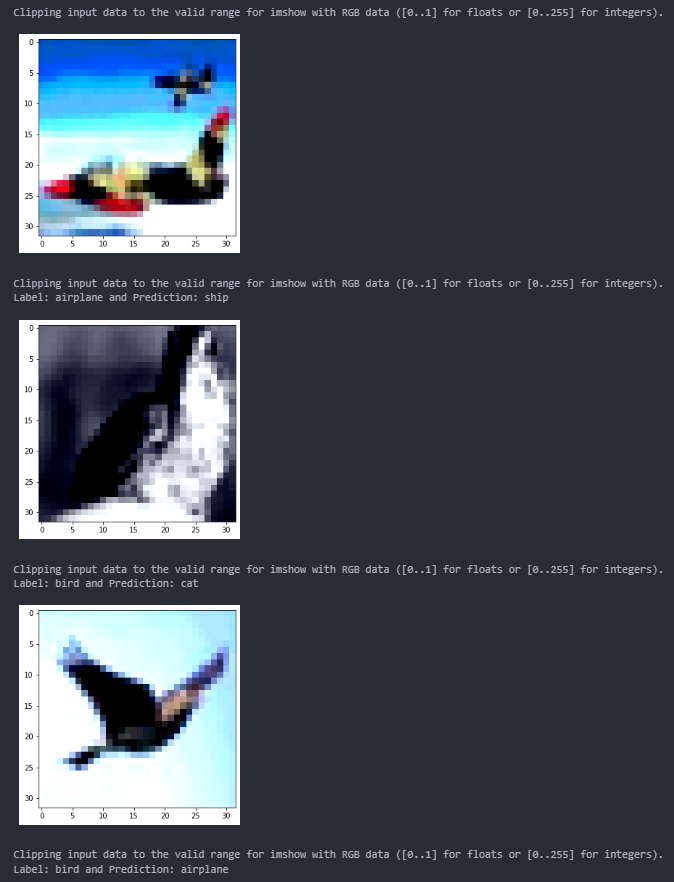
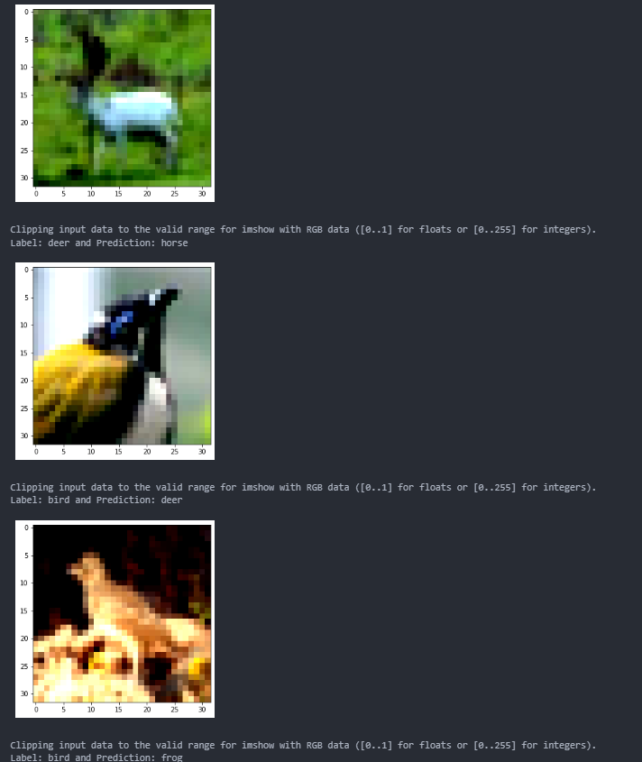
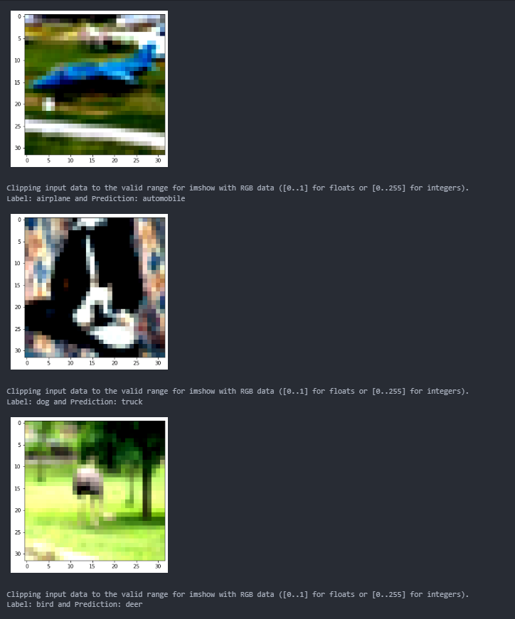
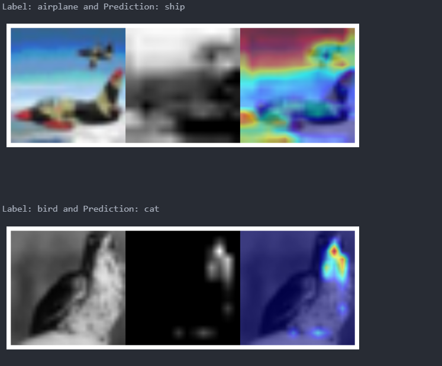
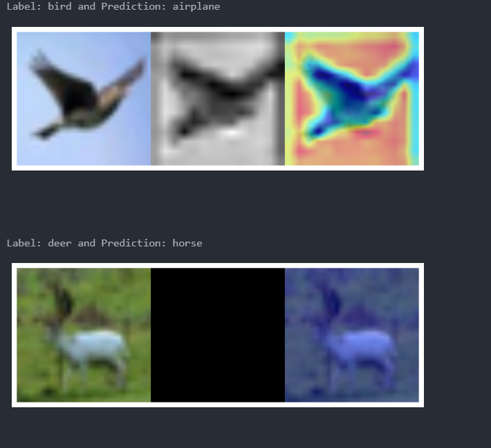
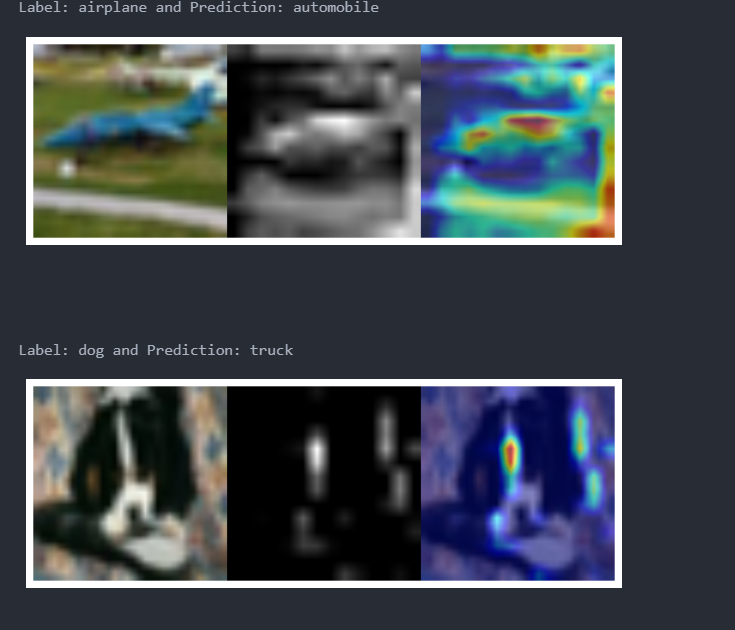
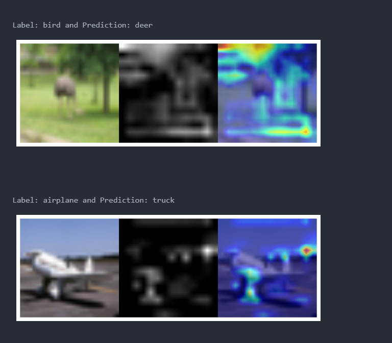

__Objective__

- Application of Multiple variants of Resnet Model for the task of Cifar-10 classification
- Train till 25 epochs with and without One Cycle Policy
- show loss curves for test and train datasets
- show a gallery of 10 misclassified images
- show gradcamLinks output on 10 misclassified images.
- Modular Code structure under src
- Process Orchestration in Notebook


__Training log__

From 15 th epoch onwards..
```python
Epoch 15
Avg Train Loss: 0.7481  Avg Train Metric: 0.7363
Avg Test Loss: 0.7093  Avg Test Metric: 0.7580
Learning rate ahead: 0.00057654
EarlyStopping counter: 1 out of 5

Epoch 16
Avg Train Loss: 0.7323  Avg Train Metric: 0.7420
Avg Test Loss: 0.7326  Avg Test Metric: 0.7521
Learning rate ahead: 0.00060407
EarlyStopping counter: 2 out of 5

Epoch 17
Avg Train Loss: 0.7200  Avg Train Metric: 0.7475
Avg Test Loss: 0.6857  Avg Test Metric: 0.7660
Learning rate ahead: 0.00063161
Validation loss decreased (0.7035 --> 0.6857). Saving model ...

Epoch 18
Avg Train Loss: 0.6962  Avg Train Metric: 0.7547
Avg Test Loss: 0.7002  Avg Test Metric: 0.7643
Learning rate ahead: 0.00065914
EarlyStopping counter: 1 out of 5

Epoch 19
Avg Train Loss: 0.6829  Avg Train Metric: 0.7607
Avg Test Loss: 0.6731  Avg Test Metric: 0.7634
Learning rate ahead: 0.00068667
Validation loss decreased (0.6857 --> 0.6731). Saving model ...

Epoch 20
Avg Train Loss: 0.6710  Avg Train Metric: 0.7676
Avg Test Loss: 0.7491  Avg Test Metric: 0.7481
Learning rate ahead: 0.00071421
EarlyStopping counter: 1 out of 5

Epoch 21
Avg Train Loss: 0.6657  Avg Train Metric: 0.7649
Avg Test Loss: 0.6526  Avg Test Metric: 0.7753
Learning rate ahead: 0.00074174
Validation loss decreased (0.6731 --> 0.6526). Saving model ...

Epoch 22
Avg Train Loss: 0.6442  Avg Train Metric: 0.7734
Avg Test Loss: 0.6680  Avg Test Metric: 0.7821
Learning rate ahead: 0.00076928
EarlyStopping counter: 1 out of 5

Epoch 23
Avg Train Loss: 0.6341  Avg Train Metric: 0.7748
Avg Test Loss: 0.6483  Avg Test Metric: 0.7804
Learning rate ahead: 0.00079681
Validation loss decreased (0.6526 --> 0.6483). Saving model ...

Epoch 24
Avg Train Loss: 0.6243  Avg Train Metric: 0.7803
Avg Test Loss: 0.6699  Avg Test Metric: 0.7659
Learning rate ahead: 0.00082434
EarlyStopping counter: 1 out of 5
```

__EvalCurves__




__EvalMetrics__
```python
              precision    recall  f1-score   support

    airplane       0.85      0.72      0.78      1000
  automobile       0.88      0.85      0.87      1000
        bird       0.74      0.71      0.72      1000
         cat       0.59      0.60      0.59      1000
        deer       0.82      0.70      0.75      1000
         dog       0.69      0.71      0.70      1000
        frog       0.79      0.86      0.82      1000
       horse       0.83      0.80      0.81      1000
        ship       0.85      0.90      0.88      1000
       truck       0.72      0.91      0.80      1000

    accuracy                           0.77     10000
   macro avg       0.78      0.77      0.77     10000
weighted avg       0.78      0.77      0.77     10000
```
__Misclassified__





__GradCam__






