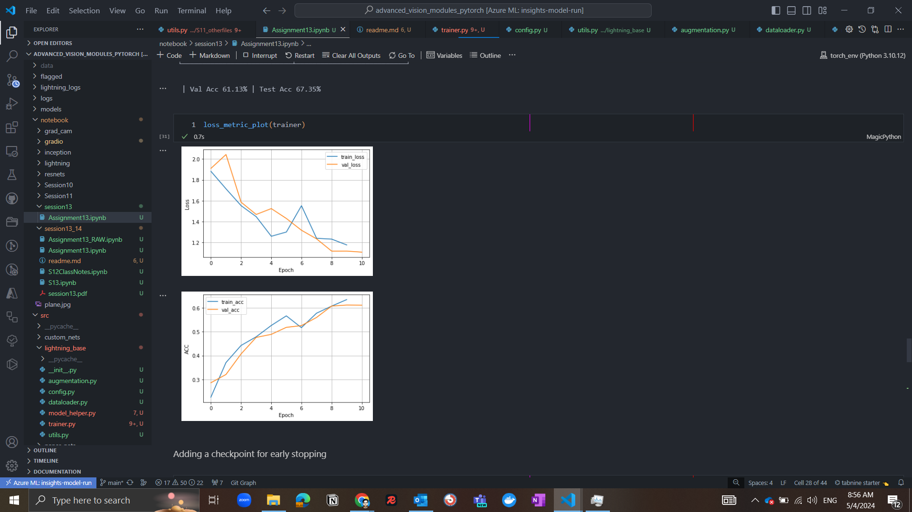

__Objective__

- Implement Cifar-10 with Pytorch Lightning
- Application of gradio for Demo App Deployed on HF Spaces


__Training Details__

```python
Files already downloaded and verified
Files already downloaded and verified
LOCAL_RANK: 0 - CUDA_VISIBLE_DEVICES: [0]

| Name      | Type               | Params
---------------------------------------------
0 | model     | ResNetX            | 21.3 M
1 | criterion | CrossEntropyLoss   | 0     
2 | train_acc | MulticlassAccuracy | 0     
3 | test_acc  | MulticlassAccuracy | 0     
---------------------------------------------
21.3 M    Trainable params
0         Non-trainable params
21.3 M    Total params
85.159    Total estimated model params size (MB)

Training: Epoch 9: 100% |  69/69 [00:12<00:00, 5.74it/s, v_num=70, train_loss=1.160, val_loss=1.120, val_acc=0.612, train_acc=0.635]
```


__Misclassified__


__GRADCAM___
